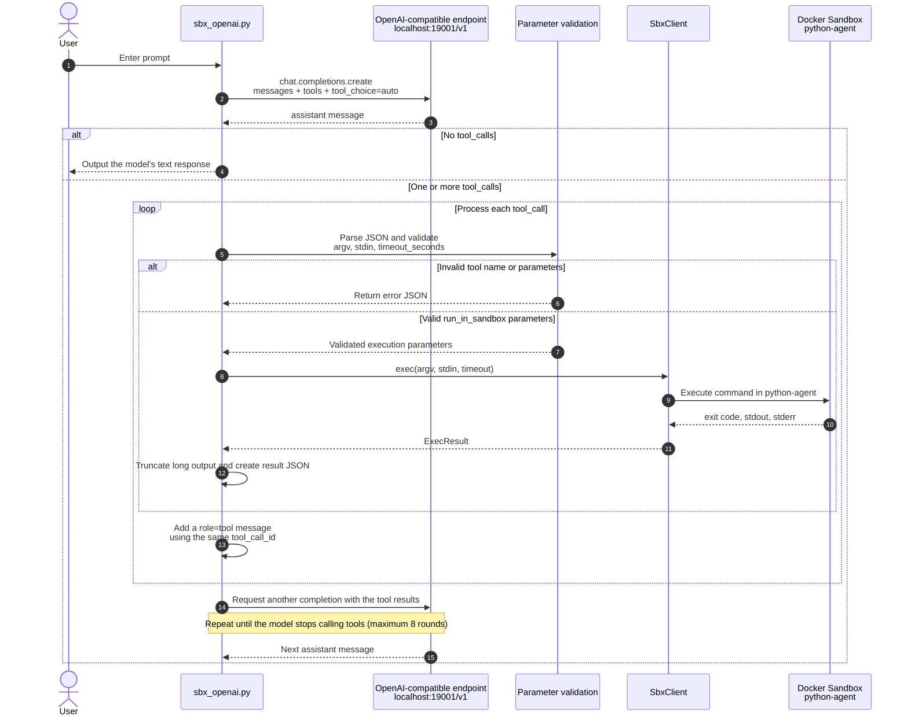

# Docker Sandbox

## Reference

* [Docker Sandbox](https://docs.docker.com/ai/sandboxes/)

## Description

* **Install**

    ```bash
    # install Docker sandbox
    winget install -h Docker.sbx
    sbx login
    ```

* **Usage**

    ```bash
    # pull `docker/sandbox-templates:shell-docker`
    sbx create --name python-agent shell
    # send command
    sbx exec python-agent python3 --version
    sbx exec python-agent uv --version
    # access sandbox
    sbx run --name python-agent
    # delete sandbox
    sbx rm --force python-agent
    ```

* **Python integration**

    ```bash
    # test sandbox is available
    python -m docs.sandbox.test.sbx_client

    # trigger tool call to sandbox
    python -m docs.sandbox.sbx_openai \
    --base-url http://localhost:19001/v1 \
    --model sonnet \
    'Use Python3 to generate the first 30 Fibonacci numbers.'

    # answer prompt directly
    python -m docs.sandbox.sbx_openai \
    --base-url http://localhost:19001/v1 \
    --model sonnet \
    'Explain what is recurrsive with one sentance.'

    ```

## `sbx_openai.py` Tool Call Flow



Key points:

- `tool_choice="auto"`: The model can answer directly or call `run_in_sandbox`.
- Each tool result is added back to the conversation with the same `tool_call_id`, allowing the model to retrieve the corresponding execution result.
- The sandbox returns `exit_code`, `stdout`, and `stderr`; output that is too long is truncated to 12,000 characters.
- The `timeout_seconds` for a single command must be between 1 and 120 seconds; the entire tool loop runs for at most 8 rounds.
