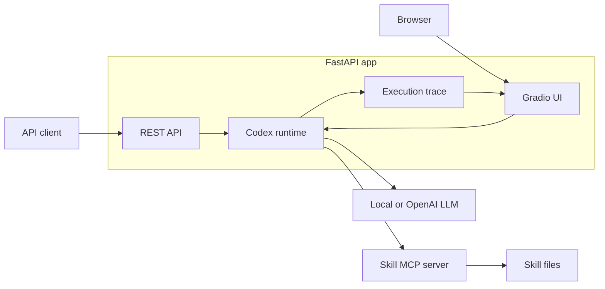
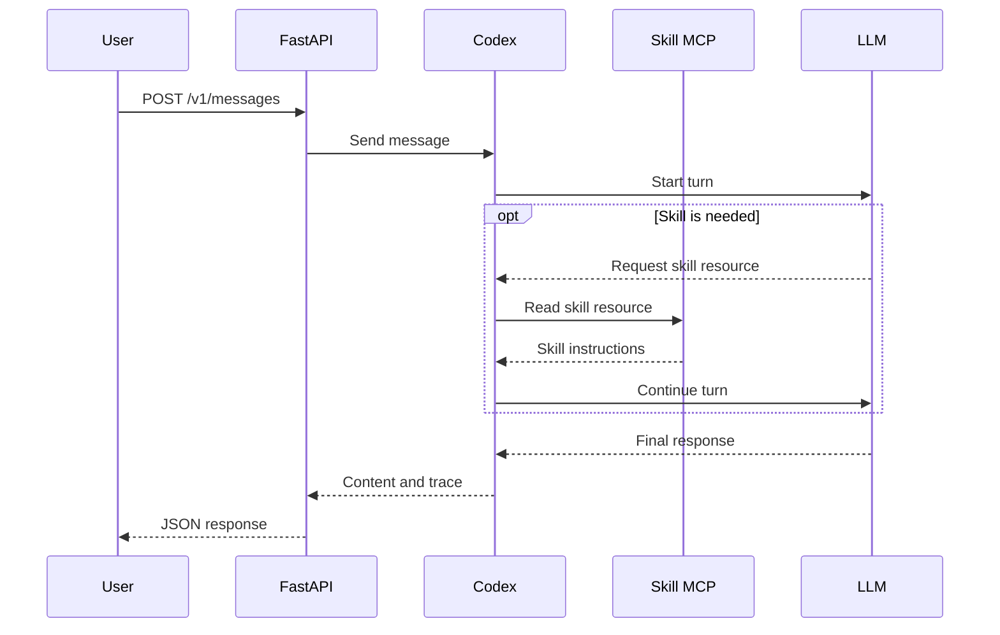

# Codex Skill API Server

This FastAPI server provides:

- A Codex chat API
- Multi-turn conversations
- A skill MCP server
- Local and OpenAI LLM support
- A Gradio UI with an execution trace

The ASGI entry point is `oai_skill.server.api:app`.

## Architecture



## Docker Compose

Run these commands from the repository root:

```bash
cp src/oai_skill/deployment/.env.example src/oai_skill/deployment/.env

docker compose \
  --env-file src/oai_skill/deployment/.env \
  -f src/oai_skill/deployment/compose.yaml \
  up -d --build
```

Open:

- UI: <http://localhost:8080/ui/>
- OpenAPI: <http://localhost:8080/docs>
- Health check: <http://localhost:8080/health/ready>

Check the service and read its logs:

```bash
docker compose \
  -f src/oai_skill/deployment/compose.yaml \
  ps

docker compose \
  -f src/oai_skill/deployment/compose.yaml \
  logs -f api
```

Stop the service:

```bash
docker compose \
  -f src/oai_skill/deployment/compose.yaml \
  down
```

## Configuration

Edit `deployment/.env` before starting the service. The sample file uses these
local development values:

- UI user: `admin`
- UI password: `change-me`
- API token: `change-me`

Change them before deploying the service outside your machine.

| Variable | Purpose | Default |
|---|---|---|
| `APP_PORT` | Public port | `8080` |
| `APP_API_TOKEN` | REST API token | Empty |
| `APP_GRADIO_USERNAME` | UI user | Empty |
| `APP_GRADIO_PASSWORD` | UI password | Empty |
| `APP_LLM_MODE` | `local` or `openai` | `local` |
| `APP_MODEL` | Model name | `sonnet` |
| `APP_LLM_BASE_URL` | Local LLM Responses API | `http://host.docker.internal:19001/v1` |
| `APP_LLM_API_KEY` | Local LLM API key | Empty |
| `APP_SANDBOX_MODE` | Codex sandbox (`danger-full-access` inside the hardened Docker container) | `read-only` |
| `OPENAI_API_KEY` | OpenAI API key | Empty |
| `APP_TURN_TIMEOUT_SECONDS` | Turn timeout | `120` |
| `APP_MAX_CONCURRENCY` | Maximum active turns | `4` |
| `APP_QUEUE_MAX_SIZE` | Gradio queue size | `32` |

A local LLM must support the OpenAI Responses API, streaming, and tool calls.

The Compose deployment sets `APP_SANDBOX_MODE=danger-full-access` because Docker
already provides the security boundary (`read_only`, dropped capabilities, and
explicit volumes). Local non-container execution keeps the safer `read-only`
default.

To use OpenAI:

```bash
export APP_LLM_MODE=openai
export APP_MODEL=<gpt-xxxx>
export OPENAI_API_KEY=<your-api-key>
```

## Run locally

```bash
python -m pip install -r src/oai_skill/deployment/requirements.txt

PYTHONPATH=src python -m uvicorn \
  oai_skill.server.api:app \
  --host 0.0.0.0 \
  --port 8080
```

## API

| Method | Path | Purpose |
|---|---|---|
| `GET` | `/health/live` | Check the process |
| `GET` | `/health/ready` | Check the Codex runtime |
| `GET` | `/v1/skills` | List skills |
| `POST` | `/v1/messages` | Send a message |

When `APP_API_TOKEN` is set, all `/v1/*` routes require a Bearer token.

Check the service:

```bash
curl -sS http://localhost:8080/health/ready
```

List skills:

```bash
curl -sS \
  -H 'Authorization: Bearer change-me' \
  http://localhost:8080/v1/skills
```

Send a message:

```bash
curl -sS \
  -X POST \
  -H 'Authorization: Bearer change-me' \
  -H 'Content-Type: application/json' \
  -d '{"message":"Reply with: hello"}' \
  http://localhost:8080/v1/messages
```

Use the returned `conversation_id` to continue the same conversation:

```bash
curl -sS \
  -X POST \
  -H 'Authorization: Bearer change-me' \
  -H 'Content-Type: application/json' \
  -d '{"conversation_id":"replace-me","message":"Continue the last answer"}' \
  http://localhost:8080/v1/messages
```

## Call a skill

Compose mounts `.agents/skills` at `/skills` as read-only. Codex reads these
files through the `skill_manager` MCP server.

```bash
curl -sS \
  -X POST \
  -H 'Authorization: Bearer change-me' \
  -H 'Content-Type: application/json' \
  -d '{"message":"Use skill_manager. Read skill://sepia, then use refactor mode. Do not use shell. Rewrite: This tool provides a better user experience."}' \
  http://localhost:8080/v1/messages
```

Message flow:



`trace.events` records `user`, `assistant`, `skill_call`, and `tool_call`
events. The UI shows these events as a flow diagram.

## Data and permissions

- The skill directory is mounted as read-only.
- Codex state is stored in the `codex-data` volume.
- The workspace is stored in the `app-workspace` volume.
- Trace output redacts common token, password, and API key fields.
